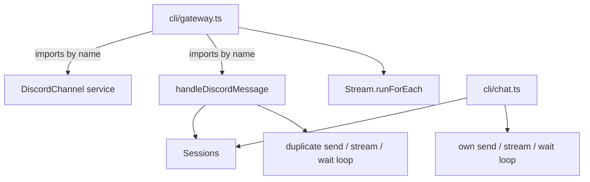
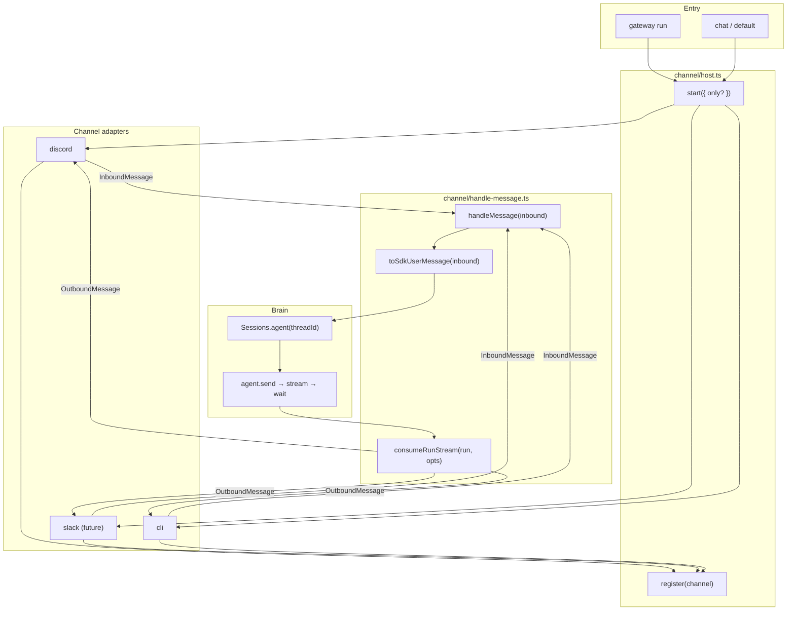
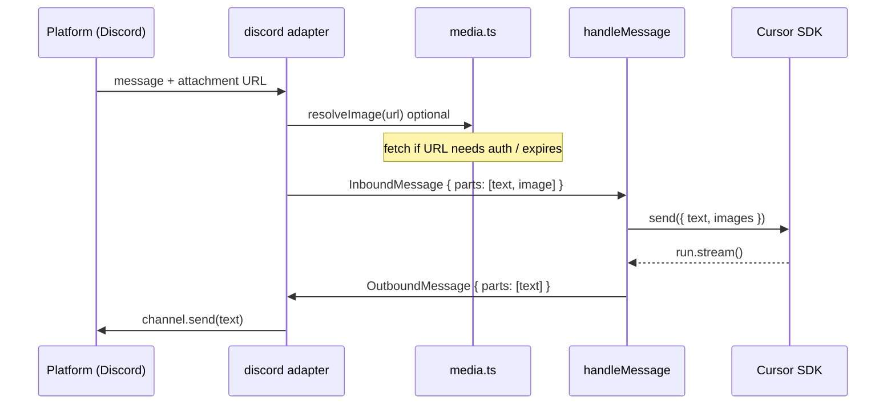
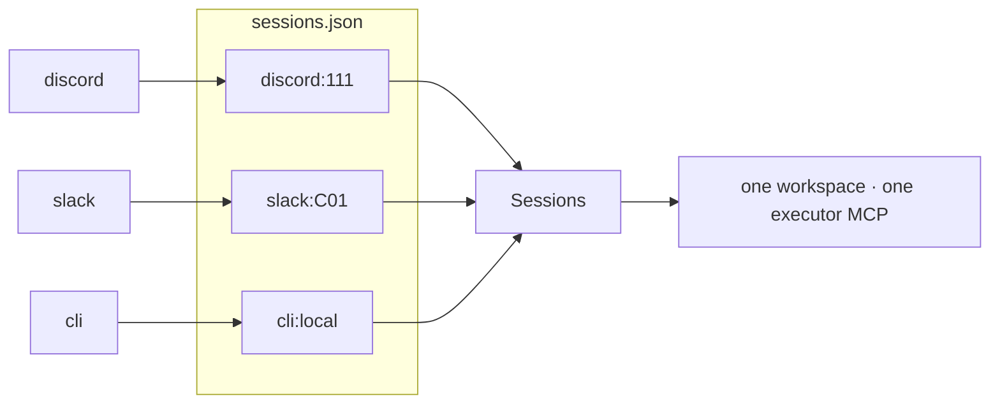
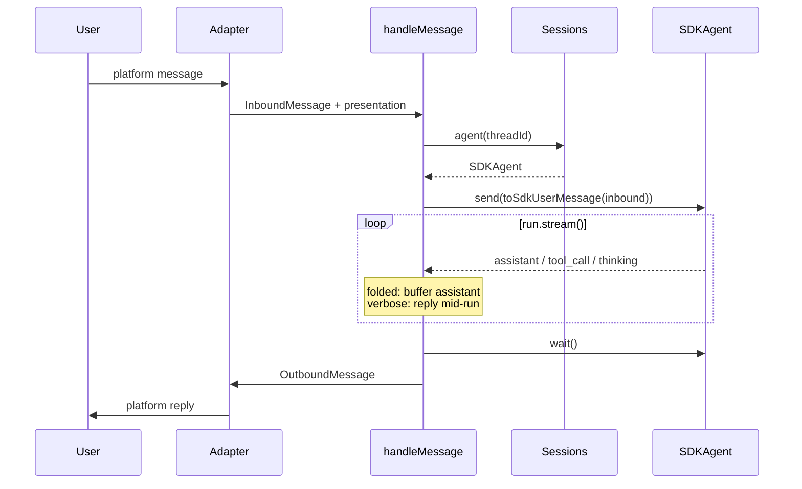

# Channel architecture plan

Plan for refactoring `@caret/agent` channel wiring: multiple frontends, one Cursor SDK brain, per-thread sessions. Replaces the current leaky `DiscordChannel` + `handleDiscordMessage` + `Stream.runForEach` pattern in `gateway.ts`.

## Fundamental problem

We have **one agent runtime** (Cursor SDK + per-thread agents) and **many frontends** (Discord, CLI, Slack, …).

Each frontend:

- receives messages in a **platform-specific** shape
- maps them to a **thread** (`discord:123`, `cli:local`, …)
- calls the SDK
- presents the SDK **event stream** back to the user in a **platform-specific** way

The problem is not “build a gateway framework.” It is:

> **Keep platform I/O separate from agent/session logic, without copying SDK wiring in every frontend.**

### Mental model

```text
Cursor SDK  →  emits events on run.stream()
Adapters    →  platform in/out; pick threadId; decide how to show events
Sessions    →  threadId → SDKAgent (create / resume / persist)
```

**Which thread is active** (e.g. CLI session switching) is an **adapter concern**. Discord maps one channel = one thread. Core does not track “active thread.”

### Design patterns and principles

| Lens | Name | What it means here |
|------|------|-------------------|
| Architecture | **Ports & adapters** (hexagonal) | SDK + Sessions = core; Discord / CLI / Slack = adapters |
| GoF | **Adapter** | Each frontend adapts platform API ↔ normalized message |
| GoF | **Facade** | `Sessions` hides store + create/resume + MCP config |
| Principle | **Single Responsibility** | Adapter = connect + translate I/O. Sessions = agent lifecycle. SDK = reasoning loop. |
| Principle | **DRY** | Shared `handleMessage` when 2+ adapters need the same send/stream/reply path |
| Principle | **YAGNI** | No extra abstraction layers until a second channel duplicates real logic |
| Deep modules | **Thin gateway, deep handler** | `gateway run` calls `ChannelHost.start()` — no Discord imports |

**Not** the problem: reimplementing the agent loop, handling executor pauses in the host, or building a presentation framework upfront.

### Inspiration (OpenClaw / Hermes)

Both solve the same shape:

**OpenClaw:** plugins `registerChannel({ plugin })` → gateway `startChannels()` → `plugin.gateway.startAccount(ctx)`. Plugin owns connect/listen; core routes inbound → agent.

**Hermes:** plugins `register_platform(...)` → `platform_registry` → `GatewayRunner.start()` → `_handle_message(event)` as **one inbound path** for all platforms.

Shared idea: **host stays dumb**, **adapters self-register**, **one shared inbound handler**.

## Current state (friction)



Symptoms:

1. Gateway is a shallow orchestrator — knows Discord, streams, and a loose handler export.
2. Two copies of “send message → read stream → reply” (chat + discord).
3. No normalized inbound message seam — Discord leaks `{ messages }` Stream + `handleDiscordMessage` as public API.
4. `AppLayer` hardcodes `DiscordChannel`.

## Target architecture



### Layer responsibilities

| Layer | Owns |
|-------|------|
| **Channel** | connect, listen, normalize platform → `InboundMessage`, denormalize `OutboundMessage` → platform |
| **handleMessage** | session lookup, `send`, stream consumption, error handling |
| **Sessions** | `threadId` → `SDKAgent`, persistence |
| **SDK** | agentic loop, tools, executor `resume` |

Gateway never imports Discord by name. It calls `ChannelHost.start()`.

## Public interfaces

### Inbound / outbound (multimodal-ready)

Use **content parts**, not bare `text`. Mirrors how platforms and the SDK work.

```typescript
// channel/types.ts

type ThreadId = `${string}:${string}` // "discord:123", "slack:C01", "cli:local"

type InboundPart =
  | { readonly type: "text"; readonly text: string }
  | { readonly type: "image"; readonly source: ImageSource }
  // future: file, audio — add when a channel needs it

type ImageSource =
  | { readonly kind: "url"; readonly url: string }
  | { readonly kind: "bytes"; readonly data: Uint8Array; readonly mimeType: string }

type InboundMessage = {
  readonly threadId: ThreadId
  readonly parts: ReadonlyArray<InboundPart>
  readonly reply: (outbound: OutboundMessage) => Effect.Effect<void>
  readonly meta?: InboundMeta
}

type InboundMeta = {
  readonly channelId: string // "discord"
  readonly authorId?: string
  readonly messageId?: string // dedup, edit-in-place later
  readonly raw?: unknown // escape hatch; core never reads
}

type OutboundPart =
  | { readonly type: "text"; readonly text: string }
  | { readonly type: "image"; readonly source: ImageSource }

type OutboundMessage = {
  readonly parts: ReadonlyArray<OutboundPart>
}
```

Text-only messages: `[{ type: "text", text: "hello" }]`.

### Channel adapter

```typescript
type ChannelCapabilities = {
  readonly inbound: ReadonlySet<"text" | "image">
  readonly outbound: ReadonlySet<"text" | "image">
}

type Channel = {
  readonly id: string
  readonly capabilities: ChannelCapabilities
  readonly start: Effect.Effect<void> // long-lived; calls handleMessage per inbound
}
```

```typescript
// channel/host.ts
type ChannelHost = {
  readonly register: (channel: Channel) => void
  readonly start: (opts?: { only?: ReadonlyArray<string> }) => Effect.Effect<void>
}
```

Registration at module load (Hermes / OpenClaw style):

```typescript
// channel/index.ts
import "./discord.ts"
import "./cli.ts"
// import "./slack.ts" when ready

// each channel file ends with:
// ChannelHost.register({ id: "discord", capabilities, start })
```

### Core handler

```typescript
// channel/handle-message.ts

type HandleMessageOptions = {
  readonly presentation: "folded" | "verbose"
}

handleMessage(
  inbound: InboundMessage,
  options: HandleMessageOptions,
): Effect.Effect<void, never, Sessions>
```

Private helpers inside the same file (not separate modules):

- `toSdkUserMessage(inbound): string | SDKUserMessage`
- `consumeRunStream(run, options, reply): Effect<void>`

### Sessions (unchanged)

```typescript
Sessions.agent(threadId: string): Effect<SDKAgent>
```

## SDK stream events

`run.stream()` yields `SDKMessage` events:

| Event | Streaming? | Notes |
|-------|------------|-------|
| `assistant` | Text yes — repeated events with text blocks | May also contain `tool_use` blocks (requests, not results) |
| `tool_call` | No — discrete lifecycle (`running` → `completed`) | Same `call_id` may appear multiple times |
| `thinking` | Yes — incremental text | |
| `status`, `task` | Discrete | |
| `system`, `user`, `request` | Discrete | Usually ignored for display |

**Assistant text is not the only streamed type** — `thinking` streams too. `tool_call` is state transitions, not character chunks.

### Presentation (per adapter, inside `consumeRunStream`)

| `presentation` | Assistant text | tool_call, thinking, status |
|----------------|----------------|------------------------------|
| `folded` | Buffer → one `OutboundMessage` at end | Ignored (SDK still runs them) |
| `verbose` | Stream or buffer | Emit as text lines via `reply` mid-run |

Typical defaults:

| Channel | Mode | Why |
|---------|------|-----|
| discord, slack, whatsapp | `folded` | One message per turn |
| cli | `verbose` | stdout for assistant, stderr for tools/thinking |

Adapters pass presentation when calling `handleMessage`:

```typescript
handleMessage(inbound, { presentation: "folded" }) // discord
handleMessage(inbound, { presentation: "verbose" }) // cli
```

## Executor pauses — host does not handle

Caret runs executor with `--elicitation-mode model` (see `sessions.ts`, `AGENTS.md`).

In model mode, executor registers a **`resume` MCP tool** the agent calls directly. Flow:

1. `execute` returns `waiting_for_interaction` to the agent
2. Agent asks the user (assistant text)
3. User replies on the channel
4. Agent calls `resume(executionId, accept | decline | cancel)`

**Delete** host-side pause decode/post (`decodeExecutorPauseFromToolCall`, `pauseMessage` in `run-helpers.ts`). Keep workspace `AGENTS.md` instructions for the agent.

## Multimodal inbound (text + images)

### SDK support

```typescript
agent.send(message: string | SDKUserMessage)

interface SDKUserMessage {
  text: string
  images?: SDKImage[] // { url } | { data, mimeType }
}
```

### Mapping

```typescript
function toSdkUserMessage(inbound: InboundMessage): string | SDKUserMessage {
  const text = inbound.parts
    .filter((p): p is TextPart => p.type === "text")
    .map((p) => p.text)
    .join("\n")
    .trim()

  const images = inbound.parts
    .filter((p): p is ImagePart => p.type === "image")
    .map(toSdkImage)

  if (images.length === 0) return text || "(empty)"
  return { text: text || "See attached image.", images }
}
```

### Responsibility split



| Step | Owner |
|------|-------|
| Detect attachment | Adapter (platform-specific) |
| Download / auth | Adapter or shared `channel/media.ts` |
| Normalize to `ImageSource` | Adapter |
| Map to `SDKUserMessage` | `handleMessage` / `toSdkUserMessage` |
| Reply with image | Adapter (SDK outbound is text-only today) |

### `channel/media.ts`

```typescript
resolveImage(source: ImageSource): Effect<SDKImage>
// url public → { url }
// url + needs auth → fetch → { data, mimeType }
// bytes → base64 + mimeType
```

### Discord inbound with image (example)

```typescript
function toInbound(message: DiscordMessage): InboundMessage | null {
  const parts: InboundPart[] = []
  if (message.content.trim()) parts.push({ type: "text", text: message.content.trim() })

  for (const att of message.attachments.values()) {
    if (att.contentType?.startsWith("image/")) {
      parts.push({ type: "image", source: { kind: "url", url: att.url } })
    }
  }

  if (parts.length === 0) return null

  return {
    threadId: `discord:${message.channel.id}`,
    parts,
    reply: (outbound) => postToDiscord(message.channel, outbound),
    meta: { channelId: "discord", authorId: message.author.id, messageId: message.id },
  }
}
```

Non-image attachments (PDF, etc.): skip in v1; add `{ type: "file" }` when SDK supports it.

## Multi-channel runtime



| Command | `ChannelHost.start({ only })` |
|---------|-------------------------------|
| `gateway run` | `discord`, `slack`, … (not `cli`) |
| `chat` / default | `cli` |

Future: `gateway run --channel discord,slack`.

## One inbound turn



## File plan

```text
packages/agent/src/
  channel/
    types.ts            InboundMessage, OutboundMessage, Channel, capabilities
    host.ts             register + start
    index.ts            side-effect imports register all channels
    handle-message.ts   handleMessage, toSdkUserMessage, consumeRunStream
    media.ts            resolveImage (url fetch, bytes → SDKImage)
    discord.ts          Channel impl + register
    cli.ts              Channel impl + register
    slack.ts            stub register (future)
  cli/
    gateway.ts          ensureWorkspace → ChannelHost.start({ only: gatewayChannels })
    chat.ts             ChannelHost.start({ only: ["cli"] }) or thin wrapper
  lib/
    sessions.ts         unchanged
    layers.ts           SessionLayer for gateway/chat; drop DiscordChannel from AppLayer
```

### Delete

- `DiscordChannel` `Context.Service` + `{ messages }` export
- `handleDiscordMessage` export
- `Stream.runForEach` wiring in `gateway.ts`
- Pause decode in `run-helpers.ts` (`decodeExecutorPauseFromToolCall`, `pauseMessage`, `ExecutorPauseSchema`)
- Keep `runFailureMessage` or inline into `handle-message.ts`

## Implementation phases

### Phase 1 — Core seam

- [ ] `channel/types.ts` — parts-based `InboundMessage` / `OutboundMessage`, `Channel`, `ChannelHost`
- [ ] `channel/handle-message.ts` — text-only path; `toSdkUserMessage` + `consumeRunStream` (folded)
- [ ] `channel/host.ts` + `channel/index.ts`

### Phase 2 — Discord adapter

- [ ] Collapse `discord.ts` → `Channel.start()`; private stream/listener
- [ ] `toInbound(raw)` → `handleMessage`
- [ ] `postToDiscord(channel, OutboundMessage)` — text parts only v1
- [ ] `gateway.ts`: `ChannelHost.start({ only: ["discord"] })`
- [ ] Remove `DiscordChannel` from `layers.ts` / `AppLayer`

### Phase 3 — CLI adapter

- [ ] Move REPL to `channel/cli.ts`
- [ ] `presentation: "verbose"`
- [ ] Active `threadId` selection stays in cli adapter
- [ ] `chat.ts` / default → start cli channel

### Phase 4 — Multimodal

- [ ] `channel/media.ts` — `resolveImage`
- [ ] Discord: map image attachments → `InboundPart`
- [ ] `toSdkUserMessage` images path
- [ ] Empty text + image → default prompt text (e.g. `"See attached image."`)

### Phase 5 — Second channel prep

- [ ] `slack.ts` stub: `register`, `start: Effect.log("not configured")`
- [ ] `ChannelCapabilities` on each channel
- [ ] `gateway run --channel` flag
- [ ] Config: per-channel tokens in `AgentConfig` schema

## Explicitly deferred

| Item | Until |
|------|-------|
| Outbound images to Discord / Slack | SDK emits image blocks or product needs it |
| File / audio `InboundPart` variants | A channel requires it |
| Message dedup / edit-in-place | Consumers of `meta.messageId` |
| Per-channel Effect services | Connect logic is heavy enough to warrant it |
| Host executor pause handling | Never — model + `resume` tool |
| `RunSink` / `RunLine` / `dispatch.ts` abstractions | Replaced by `handleMessage` + `HandleMessageOptions` |

## Checks

After each phase:

```bash
bun run check
```

Smoke:

```bash
bun packages/agent/src/main.ts debug paths
bun packages/agent/src/main.ts chat          # cli channel
bun packages/agent/src/main.ts gateway run   # discord channel (token required)
```
